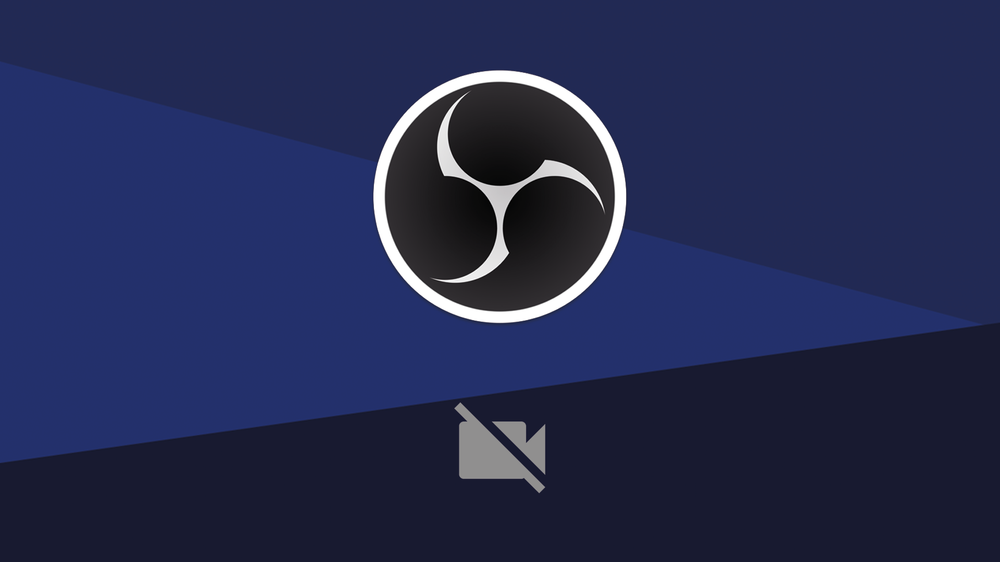

<h1 align="center">
🎬 OBS Scene Deck
</h1>

<h4 align="center"><a href="https://obsscenedeck.vercel.app/">Clique para visitar o projeto</a></h4>

---

<h2>Tecnologias utilizadas</h2>

Para o desenvolvimento deste aplicativo, utilizei as seguintes tecnologias:

- Vite

- React.JS

- SCSS

- LocalStorage

---